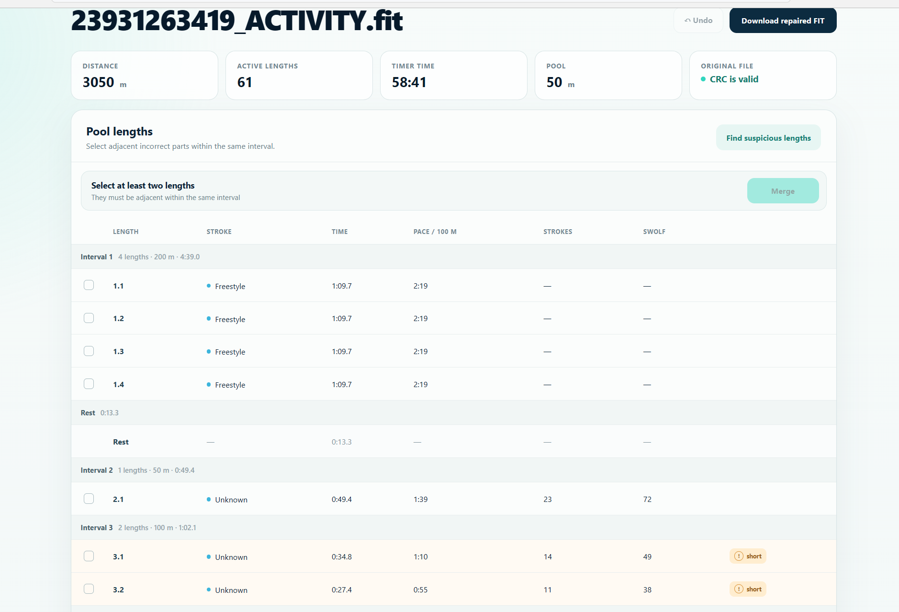
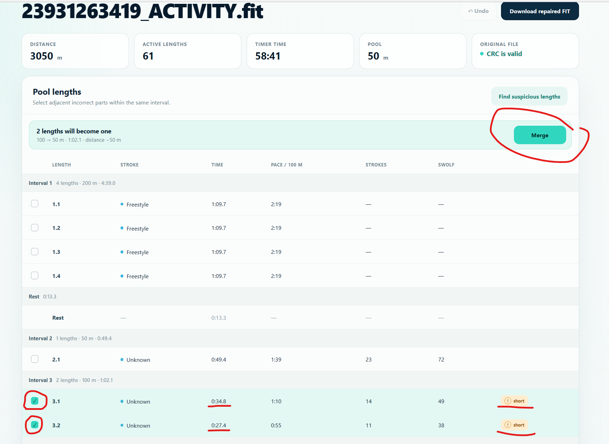
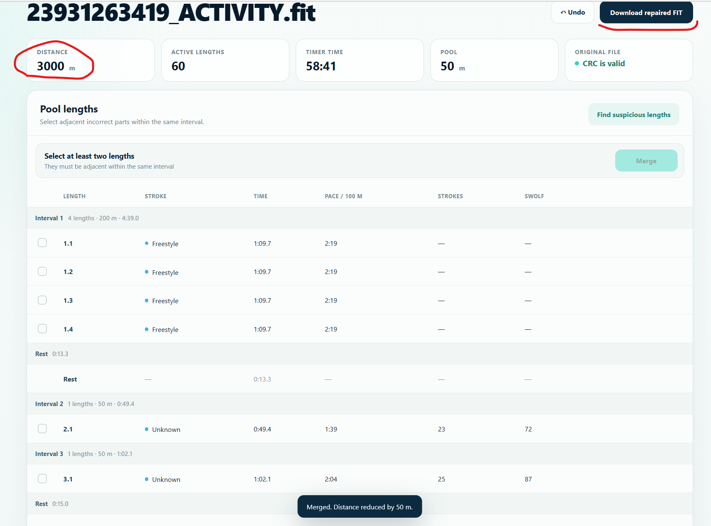

# PoolFix — Garmin Pool Swim FIT File Fixer

[English](#english) · [Русский](#русский)

## English

Use PoolFix when a Garmin pool swim records the wrong distance, adds an extra length, or records one split length as two. The repaired FIT file is validated with the official Garmin FIT SDK before you import it into Garmin Connect.

### Usage

1. Open [PoolFix online](https://coderva753.github.io/pool-swim-fit-fixer/?lang=en).
2. Drop the original `.fit` file into the application.
3. Select two or more adjacent active lengths within the same interval.
4. Click **Merge**, verify the corrected distance, and download the repaired FIT file.

The original file is never overwritten. The repaired file receives the `_fixed.fit` suffix. Before download, PoolFix validates its header, file size, CRC, and swimming-session aggregates using the official Garmin FIT SDK.

All processing happens locally in the browser's memory. The FIT file is not uploaded anywhere, and no installation, server, or runtime is required to use the built application.

### How it works

#### 1. Find suspicious split lengths

PoolFix highlights unusually short adjacent lengths that may be one pool length recorded as two.



#### 2. Select and merge

Select the adjacent parts, verify the preview, and click **Merge**.



#### 3. Verify and download

Confirm the corrected distance, then download the repaired FIT file for Garmin Connect.



### Development

```text
pnpm install
pnpm build
```

The FIT-processing logic is in `src/fit.ts`. The interface is implemented in `src/main.ts` and `src/styles.css`.

To enable optional Cloudflare Web Analytics for the deployed site, create the repository Actions variable `CLOUDFLARE_WEB_ANALYTICS_TOKEN` and set it to the Web Analytics site token issued by Cloudflare. Analytics is omitted from the build when the variable is empty. It records site visits only; FIT-file processing remains local in the browser.

## Русский

Используйте PoolFix, если Garmin неправильно определил дистанцию тренировки в бассейне, добавил лишнюю дорожку или записал одну дорожку как две. Перед импортом исправленного FIT-файла в Garmin Connect приложение проверяет его с помощью официального Garmin FIT SDK.

### Использование

1. Откройте [PoolFix онлайн](https://coderva753.github.io/pool-swim-fit-fixer/?lang=ru).
2. Перетащите исходный `.fit`-файл в окно приложения.
3. Выберите два или несколько соседних активных отрезков одного интервала.
4. Нажмите **«Объединить»**, проверьте исправленную дистанцию и скачайте готовый FIT-файл.

Исходный файл не перезаписывается. Результат получает суффикс `_fixed.fit`. Перед скачиванием PoolFix проверяет заголовок, размер, CRC и агрегаты плавательной сессии с помощью официального Garmin FIT SDK.

Вся обработка происходит локально в памяти браузера. FIT-файл никуда не загружается, а для использования собранного приложения не нужны установка, сервер или среда выполнения.

### Как это работает

#### 1. Найдите подозрительные отрезки

PoolFix отмечает соседние короткие отрезки, которые могли быть одной ошибочно разбитой дорожкой.


#### 2. Выберите и объедините

Выберите соседние части, проверьте предварительный результат и нажмите **«Объединить»**.


#### 3. Проверьте и скачайте

Убедитесь, что дистанция исправлена, а затем скачайте готовый FIT-файл для Garmin Connect.


### Разработка

```text
pnpm install
pnpm build
```

Основная логика обработки FIT находится в `src/fit.ts`, интерфейс — в `src/main.ts` и `src/styles.css`.

Чтобы включить необязательную Cloudflare Web Analytics на опубликованном сайте, создайте переменную Actions репозитория `CLOUDFLARE_WEB_ANALYTICS_TOKEN` и укажите в ней токен сайта Web Analytics, выданный Cloudflare. Если переменная пуста, аналитика не включается в сборку. Она учитывает только посещения сайта; обработка FIT-файлов по-прежнему происходит локально в браузере.
